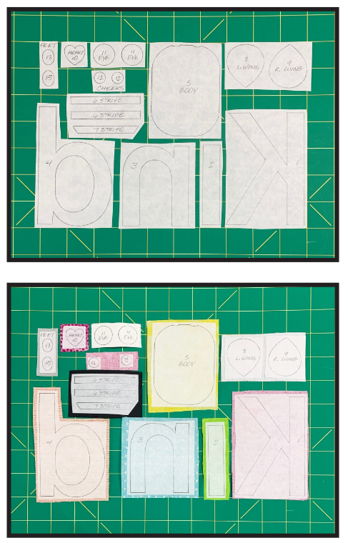

# Quilting instructions for Bee Kind Pillow

## Contact information
Designed by: Amy Bradley Designs 
Visit: www.amybradleydesigns.com  
Contact: 785-218-6803 or info@amybradleydesigns.com 

## Description
This guide provides step-by-step instructions for creating a Bee Kind pillow measuring 14 x 14 inches. It includes a comprehensive list of materials and tools needed, as well as a pre-prepared pattern and placement sheet.

## Material List
  * 13"x13" or Fat Quarter or 3/8 yd Background
  * 1/8 yd. or Fat Eighth Inside Border
  * 1/2 yd.  Outside Border & Pillow Back
  * 1 yd. Piping
  * 4" x 6"  Letter K
  * 2" x 4"  Letter I
  * 4" x 4"  Letter N
  * 4" x 6"  Letter D 
  * 4" x 5"  Body
  * 3" x 4"  Stripes
  * 3" x 4"  Wings
  * 2" x 2"  Heart
  * 2" x 3"  Eyes
  * 2" x 2" Cheeks
  * 2" x 3"  Feet 
  * White Muslin to back light fabrics
  * 1/2 yd. (17 width) HeatnBond  Lite fusible web
  * 19 x 19 piece of White Batting (Amy used Warm & White by The Warm Company )
  * Smallest package Sulky  Tear Away Iron On Stabilizer Machine embroidery thread - Amy used Gutermann 100m polyester thread several shades darker than    fabric for letters, black on bee body and stinger, Gutermann 111 grey on wings, eyes, & feet.
  * All purpose thread to match embroidery thread 
  * DMC black hand embroidery thread for eye french knots
  * Two 5/16 buttons for tops of antennae 
  * 1 7/8 yd. 3/8 Cording for Piping 
  * 14" x 14" Pillow Form

## Tools Needed
 * Mechanical Pencil
 * White pencil for dark fabrics
 * XACTO knife with #1 blade (optiona)
 * light box
 * scissors
 * rotary cutter
 * ruler
 * cutting mat
 * straight pins
 * ironing
 * ironing board
 * sewing machine
 
## Instructions

Trim white edge from side of page without border and tape pages 11-14 together to assemble the placement sheet. Trim excess paper from the back of the placement sheet. 

### 1. Back Light Fabrics with Muslin
Light fabrics that will be placed over dark fabric or a strong print need to be backed with muslin. This extra layer of  muslin makes the light fabric thicker so you can t see through the fabric. Amy backed the eye fabric on the sample. Cut a piece from fusible web large enough to fit all the light fabrics that need to be backed with muslin. Iron this  fusible web piece to a larger piece of pressed white muslin. Let cool. Cut a piece from the fused muslin and place on the back side of the light fabric. Use an iron to press according to the  fusible web instructions. The result will be a thicker piece of fabric with the light fabric on one side, the muslin on the  other side and fusible between. Repeat to back all light fabrics with muslin. 

### 2. Trace Pieces on Fusible Web
Pieces have already been reversed. Use a pencil to trace the pattern pieces and letters onto fusible web leaving 1/4"  between pieces. Write the number inside the pattern piece for easy identification.

Here is an image example for step 2: https://blah.com/step2.png
 
### 3. Press Fusible Web Pieces to Fabric
Do not cut on the pencil line. Cut fusible web around the pattern pieces and letters leaving at least 1 8 from the  outside of the pencil line. Place the fusible web pattern piece or letter on the back of the chosen fabric. Press  according to fusible web instructions. Let cool.
Here is an image example for step 3: https://blah.com/step3.png

Image: 

### 4. Cut Pieces Out on the Pencil Line
Use scissors to cut pieces and letters out on the pencil line. An X-ACTO knife with a #11 blade is great for cutting  out the inside of the letter d.
Here is an image example for step 4: https://blah.com/step4.png

 
 #### How to Cut a Strip:
  Fold fabric in half matching the selvages. Trim any excess  off the end so you have a nice straight edge. Measure over  the distance of the strip needed. Our example shows an 18"  strip. Use a long plastic ruler and a rotary cutter to cut on  the measured line.
### 5. Cut Background, Borders, & Batting

#### Background
You need one 12 1/2" x 12 1/2" background. Background is oversized to allow for a neat final trim after stitching. If cutting from yardage, cut one 12 1/2" strip. Trim one 12 1/2" x 12 1/2" background from the strip. 

#### Inside Border
  * Cut two 1 strips from inside border fabric.  
  * Trim four 1 x 11 1/2 pieces from the strips. 

#### Outside Border & Pillow Back
  * Cut two 2 3/4" strips and one 11" strip from outside border/pillow back fabric. 
  * Trim one 2 3/4" strip into two 16 pieces.  
  * Trim the remaining 2 3/4" strip into two 11 1/2" pieces. 
  * Trim the 11 strip into two 15 pieces for pillow back.

#### Batting
  * From white cotton batting, cut a 19" x 19" piece.
 
### 6. Place Pattern Pieces on Background Fabric
On a light box, put the placement sheet right side up. Place the 12 1/2" x 12 1/2" background fabric over the placement sheet. There should be fabric outside the trim line on all sides. Remove paper backing from fusible web and place  pattern pieces 1-13 in numerical order on background fabric using placement sheet as a guide. Tack pieces lightly with  an iron as you go. Transport background fabric to ironing board. Press following fusible web instructions. Let cool. 

### 7. Mark the Detail Lines
On a light box, align background fabric over the placement sheet again. Use a mechanical pencil (white pencil for dark  fabrics) to lightly trace these detail lines onto the fabric. 
 *  Mark small dots for eyes and button centers.  
 *  Mark antennae, smile, legs, and stinger.

####  Stitching Tips
The pillow on the cover was blanket stitched by machine using embroidery thread with matching all purpose thread in the bobbin. Amy used Gutermann 100m polyester thread several shades darker than fabric for letters.  She used black thread on bee body and stinger. She used Gutermann 111 grey thread on wings, eyes, & feet. 

Reduce the blanket stitch size as needed for smaller pattern pieces. Practice blanket stitching by fusing scrap pieces  of fabric to a piece of muslin. See more stitching tips from Amy on page 15. 

### 8. Blanket Stitch Around Pieces 
Blanket stitch around all fabric edges. Pull any loose threads to the back. Tie in two knots and thread through a few  stitches then trim.

### 9. Add Stabilizer
Stabilizer pieces prevent the fabric from gathering when the detail lines are stitched on a single layer of fabric. Place  fabric background upside down on a light table. Cut pieces of stabilizer large enough to cover the areas behind  antennae, legs, and stinger to be stitched. Cover these areas on the back of the fabric with stabilizer. Transport to  ironing board and fuse. 

### 10. Stitch Detail Lines
Double straight stitch the smile, antennae, and legs detail lines using embroidery thread with matching all purpose  thread in the bobbin. To double straight stitch, stitch over a line, then pivot and stitch back using the same holes. Pull  all loose threads to the back. Tie two knots and thread through a couple of stitches then trim. Use a narrow satin stitch  for the stinger. Use six strands of DMC black embroidery thread to add french knots for eyes. Remove stabilizer  after stitching. 
### 11. Trim Background
Press stitched background on wrong side of fabric. Place stitched background over placement sheet and mark trim line  of 11 1/2" x 11 1/2" on all four corners lightly with a mechanical or white pencil. Place on cutting mat, double check  that measurements are 11 1/2" x 11 1/2". Square and trim using a rotary cutter and a ruler. 
  
### 12. Add Inside Border
Press the four 1" x 11 1/2" inside border pieces in half lengthwise with the right side out. Pin the 11 1 2 pieces to the  sides of the background aligning raw edges (fold toward inside). Sew a 3/16" seam. Press. 

Pin the remaining 11 1/2" pieces to the top and bottom of the background aligning raw edges (fold toward inside). Sew  a 3/16" seam. Press. 

### 13. Add Outside Border
Placing right sides together, pin the 2 3/4" x 11 1/2" pieces to the sides of the background.  Sew using a 1/4" seam. Press seams toward darker fabric.

Placing right sides together, pin the 2 3/4" x 16" pieces to the top and bottom of the background.  Sew using a 1 4 seam. Press seams. The finished size is 16" x 16".

### 14. Quilting
Trim any seam allowances and clip any threads that may show through the front of the quilt. Press. Mark quilt top  lightly as desired for quilting before layering. Layer the batting and quilt top and pin. Baste all three layers together  and quilt by machine or hand. 
 
### 15. Trim Pillow Top
Trim quilted pillow top to 15" x 15" . Place on cutting mat, double check the final trim measurements of 15" x 15".  Square and trim using a rotary cutter and a square ruler. 

### 16. Add Buttons
Sew two 5/16" buttons for the tops of antennae.

### 17. Pillow Back with Piping 
Cut 2 3/8" strips on the bias or 45 degree angle of your piping fabric. Sew strips together to get 70" length. Press seams open. Cut a piece of 3/8" cording to 70" length. 
Wrap 3/8" cording with bias strips right sides out and placing raw edges together. Pin into place. Baste close to cording  with a zipper foot. 
 
Place pillow top right side up. Start in the middle of the bottom of the pillow and leave a 1 1/2" tail unpinned at the  beginning. Pin piping around outside edge of pillow top matching raw edges. At corners, snip piping seam allowance  a couple of times to wrap piping around corners. Be careful not to snip the basting.

Continue pinning around the pillow until you are 1 1/2" away from where you started.  Again leave a 1 1/2" tail that overlaps the first tail.

Open the piping and cut the two ends of the cording (not the bias fabric) so they meet. Remove some of the basting  stitches. Fold one of the 1 1/2" tails under 1/2" on the end and pin. Tuck the other tail inside of this and pin into place. 

Baste in place close to piping being sure to baste down the little corner snips so they lay flat. Remove pins after  basting.

On each 11" x 15" pillow back rectangle, fold the 15" side over 1/4" to the reverse side and press. Fold it over another  1/4" and press. Stitch 3/16" from the edge. Press.

Place quilted pillow front with piping pinned on right side up. Place  the two pillow back pieces face down over the pillow top so right sides are together. Pin into place overlapping the  back pieces. Baste close to piping. Remove pins. 

Stitch around pillow using a 1/2" seam and a zipper foot. Trim corners close to seams. Turn pillow right side out and  remove any basting stitches that show on the front. Insert a 14" x 14" pillow form.

